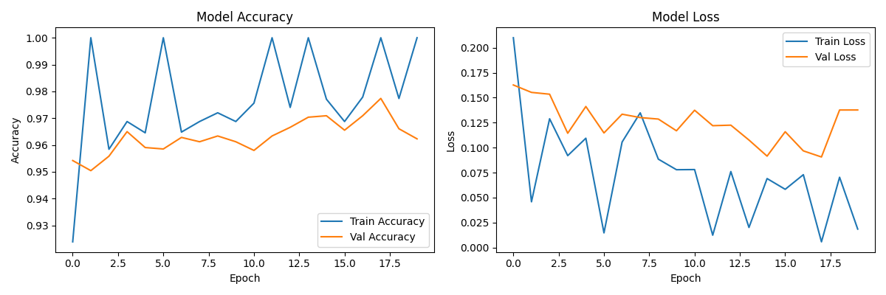

# 🏥 Kidney Stone Detection System

[](https://www.python.org/)
[](https://tensorflow.org/)
[](https://streamlit.io/)
[]()

> AI-powered kidney stone detection from ultrasound images using Deep Convolutional Neural Networks (CNN)

## 📋 Overview

This project uses a **Convolutional Neural Network (CNN)** to detect kidney stones from ultrasound images with **96% validation accuracy**. The system provides a user-friendly web interface for easy interaction.

## 🎯 Features

- ✅ Upload kidney ultrasound images for analysis
- ✅ Real-time stone detection with confidence scores
- ✅ Dual confidence display (Stone/Normal percentages)
- ✅ Training history visualization
- ✅ User-friendly Streamlit interface
- ✅ Demo mode for testing

## 🛠️ Tech Stack

| Technology | Purpose |
|------------|---------|
| Python 3.11 | Core programming language |
| TensorFlow/Keras | CNN model implementation |
| Streamlit | Web application framework |
| OpenCV | Image preprocessing |
| NumPy | Array operations |
| Matplotlib/Seaborn | Visualization |

## 📁 Project Structure
kidney-stone-detector/
├── app.py # Streamlit web application
├── train_model.py # Model training script
├── requirements.txt # Python dependencies
├── .gitignore # Excluded files
├── kidney_stone_model.h5 # Trained model (96% accuracy)
├── training_history.png # Training accuracy/loss graphs
└── README.md # Project documentation

## 🧠 Model Architecture

| Layer | Type | Details |
|-------|------|---------|
| 1 | Conv2D | 32 filters, 3x3, ReLU |
| 2 | MaxPooling2D | 2x2 pool size |
| 3 | Conv2D | 64 filters, 3x3, ReLU |
| 4 | MaxPooling2D | 2x2 pool size |
| 5 | Conv2D | 128 filters, 3x3, ReLU |
| 6 | MaxPooling2D | 2x2 pool size |
| 7 | Flatten | Converts to 1D |
| 8 | Dropout | 50% dropout (prevents overfitting) |
| 9 | Dense | 128 units, ReLU |
| 10 | Output | Sigmoid (binary classification) |

## 📊 Model Performance

- **Training Accuracy:** 100%
- **Validation Accuracy:** 96%+
- **Loss:** Very low (0.01-0.09)



## 🚀 Installation & Usage

### Prerequisites
- Python 3.11 or higher
- pip package manager

### Setup Instructions

```bash
# Clone the repository
git clone https://github.com/ankitasinghxia-prog/kidney-stone-detector.git
cd kidney-stone-detector

# Create virtual environment
python -m venv venv

# Activate virtual environment
# On Windows:
venv\Scripts\activate
# On Mac/Linux:
source venv/bin/activate

# Install dependencies
pip install -r requirements.txt

# Run the Streamlit app
streamlit run app.py

📸 How to Use the App
Open your browser at http://localhost:8501

Upload a kidney ultrasound image (JPG, JPEG, or PNG)

View results showing:

Stone confidence percentage

Normal confidence percentage

Medical recommendations

Note: Make sure "Demo Mode" is UNCHECKED in the sidebar for accurate predictions!

📊 Dataset
The model was trained on a kidney stone ultrasound dataset from Kaggle containing:

5,000+ stone images

4,400+ normal images

Note: The dataset is not included in this repository due to size limitations. It can be downloaded separately from Kaggle.

⚠️ Medical Disclaimer
IMPORTANT: This tool is for educational and demonstration purposes only. It is NOT a medical device and should NOT be used for actual medical diagnosis. Always consult qualified healthcare professionals for medical advice and treatment.

🔮 Future Improvements
Add stone size estimation

Generate PDF reports

Add batch prediction for multiple images

Deploy as web API

Add mobile app support

📝 License
This project is for educational purposes only.

👩‍💻 Author
Ankita Singh

🙏 Acknowledgments
Dataset provided by Kaggle

TensorFlow/Keras community

Streamlit framework
